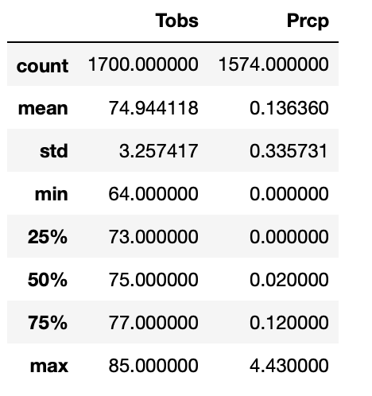
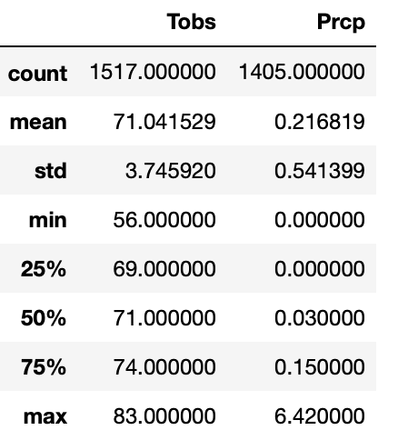

# *Surf's Up With Advanced Data Storage And Retrieval.*

## *Project Overview*

Holly has an idea to run "surf n' shake" shop serving surf boards and ice creams to locals and tourists. To continue to make the idea work, there will be need of real investors backing to get this off the ground. So after putting together a strong business plan, Holly reaches out to an investor W.Avy, who is famous for his love for surfing.

Holly's first meeting with the investor goes really well, but he has one concern about the weather. He is extremely serious about this.

W.Avy has asked Holly to run analytics on weather data set that he has from the very island where the plan is to open the surf shop, the beautiful Oahu in Hawaiian.

## *Resources*

* Data Source: hawaii.sqlite.

* SQLite.

* Flask.
* Open-source distribution software Anaconda and the Jupiter   notebook.

* Pandas, NumPy, Matplotlib, sqlalchemy, datetime  libraries for python.

* Visual Studio Code.

## *Procedure*

The analysis was performed on the data from hawaii.sqlite.The full procedure and the results are present in the **climate_analysis.ipynb** file.

## *Challenge Overview*

W. Avy likes the analysis, but he feels there is one piece of information missing: seasonal data. He’s asked Holly to gather data on the seasons of Oahu and determine whether the seasons could affect the surf and ice cream shop business. Specifically, are there certain times of the year when business might be slower, or the type of customer could be different?

1). Identify key statistical data in June across all of the   stations and years using the describe() function.

2). Identify key statistical data in December across all stations and years using the describe() function.

## *Results*

 Share your findings in the Jupyter Notebook with a few sentences describing the key differences
 in weather between June and December and 2-3 recommendations for further analysis.

There are 1700 total number of temperature observations for the month of June across all of the stations and years in the measurement table where as there are 1517 total number of temperature observations for the month of December across all of the stations and years in the measurement table. There are more null values for temperature observations during the month of December in comparison to June.

The average number of temperature observations for the month of June is 74.94 and the average number of temperature observations for the month of December is 71.04.The temperature values are lower for the month of Decemeber as compared to June.

The standard deviation of temperature observations for June is 3.26 and the standard deviation of temperature observations for December is 3.75.The standard deviation for June is slightly low as compared to the standard deviation for December. The temperature values for the month of June are litter closer to the meanwhile the values of temperature for the month of December are spread out a bit.

The smallest value for temperature recorded in the dataset for the months of June is 64 and for Decemeber it is 56.The largest temperature value for the months of June is 85 and the highest temperature recorded in December is 83. 

The 25th percentile temperature for the months of June is 73 and December is 69, there is only a difference of 1 between the two. The median or the 50th percentile for temperature for June is 75 and the median or the 50th percentile temperature for December is 71. The median (the middle value) for June is lower than in December, there is a difference of 4 between the median of temperature for December and June.

The 75th percentile for temperature for the month of June is 77 and for December the 75th percentile for temperature is 74. The 75th percentile temperature for June is a higher than of Decemeber, there is slight a difference of 3 between the 75th percentile of precipitation in December and June.

There are 1574 total number of precipitation for the month of June across all of the stations and years in the measurement table where as there are 1405 total number of precipitation for the month of December across all of the stations and years in the measurement table. There are more null values for precipitation in the month of December in comparison to June. 

The average number of precipitation for the month of June is 0.14 and the average amount of precipitation for the month of December is 0.22. There is more precipitation in the month of Decemeber as compared to June so we can conclude that there is more precipitation in winter as compared to summer in Oahu.

The standard deviation of precipitation in June is 0.34 and the standard deviation of precipitation in December is 0.54. The standard deviation for June is low as compared to the standard deviation for December. The precipitation values for the month of June are closer to the meanwhile the values of precipitation for the month of December are spread out over a wide range.

The smallest value for precipitation recorded in the dataset for the months of June and Decemeber is 0. The largest value for precipitation in the months of June is 4.43 and the largest value for precipitation recorded for December is 6.42. 

The 25th percentile precipitation for the months of June and December is 0. The median or the 50th percentile precipitation in June is 0.02 and the median or the 50th percentile precipitation for December is 0.03. The median (the middle value) for June is lower than in December, there is a difference of 0.01 between the median of precipitation in December and June.

The 75th percentile precipitation for the month of June is 0.12 and for December the 75th percentile precipitation is 0.150000. The 75th percentile precipitation in June is a little lower than of Decemeber, there is slightly a difference of 0.03 between the 75th percentile of precipitation in December and June.

## *Summary*

CONCLUSION: 

The mean temperature for the month of June is 74.94, and the mean temperature for December is 71.04 across all the stations and years in the measurement table. Temperature is higher in the month of June as compared to December. In summer a lot of people enjoy surfing, and they are more likely to eat ice cream with warmer temperatures. It is much warmer in June since the minimum temperature value is 64 and the minimum temperature value in December is 56.
Also, there is more precipitation in the month of December as compared to June, so we can conclude that there is more precipitation in winter time as compared to summer. After viewing the statistics we can say that the seasons could affect the surf and ice cream shop business. Therefore, surfing business might be slower in winter in contrast to summer in Oahu.

RECOMMENDATIONS FOR FURTHER ANALYSIS.

The analysis performed throughout the module only took values for one year (2016-08-23 to 2017-08-23) from the measurement table. If the number of years can be increased and more data can be used, the analysis can be more strong and can be more powerful in decision making. There are many temperature observations and precipitation values that are null in the dataset. It is a good idea to account for those null values for the further analysis.

Recent data is missing because of which it is hard to tell if patterns in the data are still the same in todays time or not. For the future, it would be a good idea to perform the analysis on the recent data.

We should also take the limitations of the dataset into account when performing further analysis. 

We should include more visualization when performing additional analysis. For example, to compare the temperatures in the month of June and December, a graph can show trends more clearly for the temperatures over the years. We could also compare more months to get a strong analysis result.